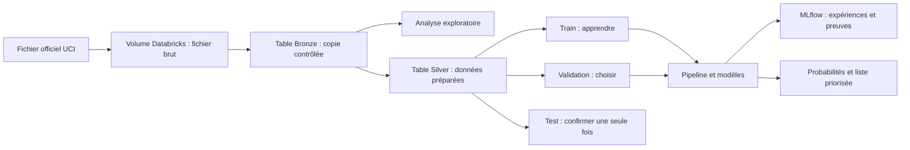

# 5. Comment le projet fonctionne

[Retour à l'index](README.md)

## Vue d'ensemble

Le projet transforme progressivement un fichier historique en un outil de
priorisation. Chaque étape a un rôle précis et laisse une preuve vérifiable.

## Étape 1 — Conserver le fichier officiel

Le fichier CSV officiel est téléchargé depuis UCI, puis placé dans un Volume
Databricks. Un Volume est comparable à un espace de fichiers géré par la
plateforme.

Le CSV n'est pas placé dans GitHub. GitHub conserve le code et la documentation,
alors que le Volume conserve les données d'exécution.

## Étape 2 — Créer Bronze

Bronze est la copie contrôlée du fichier brut. On peut l'imaginer comme une
preuve scellée : elle doit rester fidèle à la source.

Avant d'écrire Bronze, le projet vérifie :

- l'empreinte numérique du fichier ;
- le nombre de lignes et de colonnes ;
- les noms et l'ordre des colonnes ;
- la distribution de `yes` et `no` ;
- le nombre de répétitions exactes.

Une colonne `_source_row_number` est ajoutée avant le passage à Spark. Elle
conserve la position de chaque ligne dans le fichier chronologique. Sans elle,
une table distribuée n'a pas d'ordre garanti.

## Étape 3 — Explorer avant de transformer

L'analyse exploratoire, souvent abrégée EDA, répond notamment à ces questions :

- quelle est la forme des données ?
- quelles catégories sont présentes ?
- existe-t-il des valeurs inconnues ou extrêmes ?
- la cible est-elle équilibrée ?
- certaines variables révèlent-elles accidentellement le futur ?
- les relations observées semblent-elles plausibles ?

Les graphiques ne prouvent pas qu'une variable cause une souscription. Ils
servent à comprendre les données et à justifier les transformations suivantes.

## Étape 4 — Créer Silver

Silver est la version préparée pour la modélisation. Contrairement à Bronze,
elle peut appliquer des règles documentées :

- conserver la première occurrence et retirer 12 répétitions exactes ;
- convertir la cible `yes/no` en `1/0` ;
- transformer la sentinelle `pdays=999` ;
- simplifier les noms contenant des points ;
- étiqueter chaque ligne `train`, `validation` ou `test` ;
- définir la liste des variables autorisées avant l'appel.

Silver conserve `duration` uniquement pour l'audit. Le code des modèles utilise
une liste séparée qui ne contient pas cette colonne.

## Étape 5 — Séparer le passé du futur

Le fichier étant ordonné chronologiquement, le projet utilise :

- les premiers 60 % pour l'entraînement ;
- les 20 % suivants pour la validation ;
- les derniers 20 % pour le test final.

Après retrait des répétitions, les tailles attendues sont :

| Ensemble | Rôle | Lignes attendues |
|---|---|---:|
| entraînement | apprendre les paramètres | 24 705 |
| validation | comparer les options et fixer le seuil | 8 235 |
| test | simuler une période future, une seule fois | 8 236 |

Le taux de souscription brut change fortement entre les périodes : environ
4,81 % dans le premier segment, 11,07 % dans le deuxième et 30,83 % dans le
dernier. Cette différence montre que le contexte évolue et justifie une
évaluation temporelle plutôt qu'un mélange aléatoire.

## Étape 6 — Construire une pipeline

Une pipeline est une recette qui enchaîne toujours les mêmes opérations :

1. sélectionner les variables autorisées ;
2. traiter d'éventuelles valeurs manquantes ;
3. encoder les catégories ;
4. normaliser les nombres si le modèle en a besoin ;
5. entraîner le modèle ;
6. calculer une probabilité.

La pipeline est ajustée uniquement sur `train`. Elle transforme ensuite
`validation`, `test` et les nouveaux clients sans réapprendre leurs statistiques.

## Étape 7 — Comparer plusieurs modèles

Le projet prévoit :

- un modèle naïf comme point de comparaison ;
- une régression logistique, simple et interprétable ;
- un arbre de décision, facile à visualiser ;
- une forêt aléatoire, plus robuste qu'un arbre unique ;
- éventuellement k-NN si son coût et sa performance sont raisonnables.

Le choix final ne reposera pas sur une seule note. Performance, stabilité,
interprétabilité, coût et risques seront comparés.

## Étape 8 — Enregistrer les expériences

MLflow conserve pour chaque essai :

- le modèle utilisé ;
- les paramètres ;
- les métriques ;
- la durée de l'entraînement ;
- les graphiques ;
- le modèle sauvegardé.

Cela empêche de choisir un résultat seulement parce qu'on se souvient qu'il
semblait bon. Les expériences deviennent comparables et traçables.

## Étape 9 — Produire une décision métier

Le modèle final donne une probabilité, pas seulement `yes` ou `no`. La banque
peut alors :

- classer les clients ;
- sélectionner les meilleurs scores selon son budget ;
- estimer le nombre de souscriptions trouvées ;
- modifier le seuil si le coût d'appel change.

## Ordre des notebooks

| Notebook | Rôle | État |
|---|---|---|
| `00_configuration.py` | crée ou retrouve catalogue, schéma, Volume et chemins | exécuté |
| `01_ingestion_bronze.py` | vérifie le CSV et écrit Bronze | exécuté |
| `02_eda.py` | explore la qualité, les distributions et la fuite | exécuté |
| `03_preprocessing_silver.py` | prépare Silver et les segments temporels | préparé, à exécuter |
| `04_modeling_baselines.py` | construira la pipeline et les références | à venir |
| `05_tuning_mlflow.py` | comparera les réglages dans MLflow | à venir |
| `06_final_evaluation.py` | évaluera le choix figé sur test | à venir |

Le numéro au début du nom rappelle l'ordre d'exécution.
